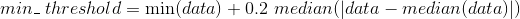

# [ALeRCE](http://alerce.science) AVRO Service
[](https://alerceapi.readthedocs.io/en/latest/avro.html?badge=latest)

ALeRCE Stamp Service stores and gives access to AVRO files, Stamps and Metadata for ZTF and other surveys.


## Documentation
The current documentation can be found [here](https://alerceapi.readthedocs.io/en/latest/avro.html).

## How the data is stored

### On Amazon S3 storage

The index for objects in S3 is in the form `<reverse_candid>.avro`. That means that if an alert has `candid = 123`, the reverse candid would be `reverse_candid = 321`.

### On disk

The stamp service uses a 8 folder configuration to store the data.

By default is mounted on the following directories `/mnt/stamps/[0-7]`.

Each time a new avro is uploaded a hash function is calculated over the object id `oid` of the file, using that hash value it is stored in one of the 8 disks, this gives a uniform distribution of data between the disks.

## How a Stamp is transformed into *png*.

Using the straightforward approach to generate an image from the stamp can gives an low contrast image.


To get a better image we scale the data with a min/max threshold.

For the max threshold we select a window around the central object and get the max value of that window.


And for the min threshold we use the following

<p align="center">
  
</p>

## Deploying Stamp Service


The stamp service is deployed as a docker container, to build the image run:
```
  docker build -t stamp_service .
```

Then the container can be created with
```
  docker run --name stamp_service -p 8087:8087 \
             -v <disks_path>:/mnt/stamps
              stamp_service
```

Configuration env variables for the container are:

```
BUCKET_NAME       Name of the S3 bucket        (no default)         Required
MARS_URL          URL for the MARS API         (no default)         Required
USE_DISK          Wether to use disks          (no default)         Optional (Do not set this variable if not using disks)
ROOT_PATH         Location of disks            (no default)         Required if USE_DISK is set
NDISK             How many disks are used      (no default)         Required if USE_DISK is set
PYTHONHASHSEED    Seed for Hash calculation    (default 0)          Optional if not using disks
APP_BIND          Gunicorn bind address        (default 0.0.0.0)
APP_PORT          Gunicorn port                (default 8087)
APP_WORKERS       Gunicorn num of workers      (default 6)
TEST_MODE         If running unittest          (no default)         Optional (Do not set this variable if in production)
```
